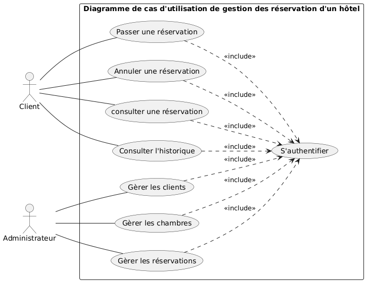
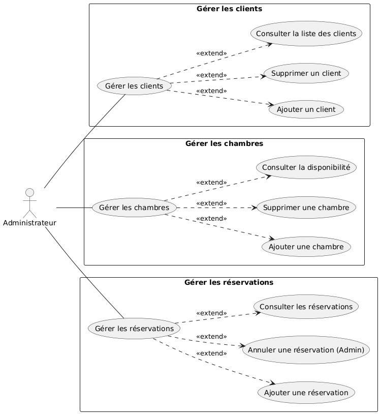
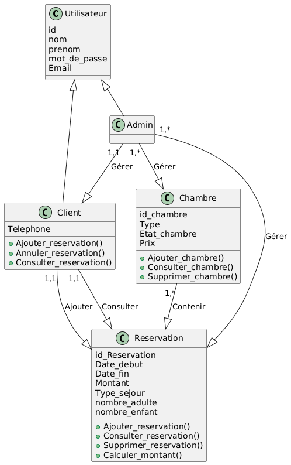
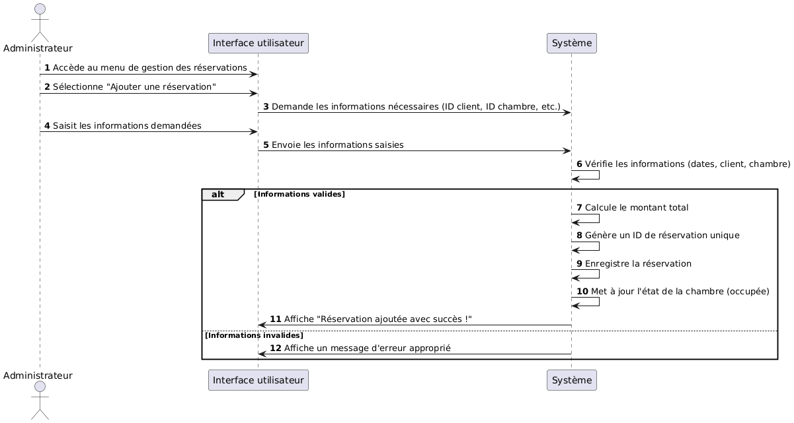
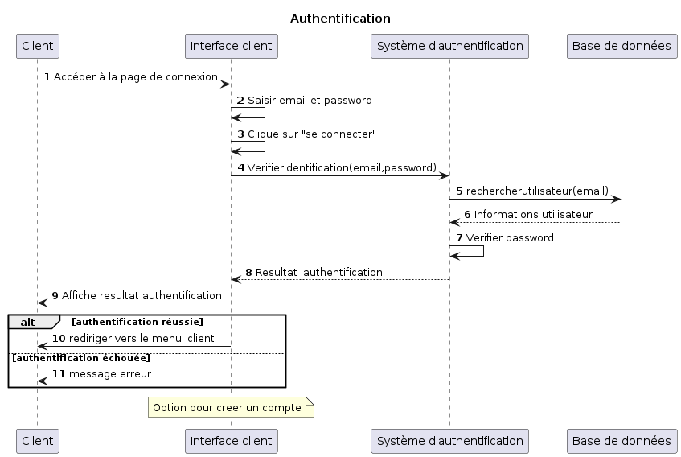

# GithubAGL
#  Application de Réservations d'Hôtel  

 Date de soumission : 07-04-2025  
 Auteurs : Ilef Marouani - Linda Hajjeji - Chayma kouki - Molka Mansouri 

---

## 1️⃣ Introduction au projet  
L'objectif de ce projet est de développer une application permettant la gestion des **réservations d'hôtel**.  
Cette application vise à **simplifier la gestion des chambres, des clients et des réservations** en offrant une plateforme **intuitive et efficace**.  

---

## 2️⃣ Spécification du projet  

###  a) Notions de base et contraintes  
✔️ **Authentification des utilisateurs** (administrateurs et clients).  
✔️ **Interface utilisateur intuitive** avec menu interactif.  
✔️ **Gestion des clients** (ajout, suppression, consultation).  
✔️ **Gestion des chambres** (ajout, suppression, consultation des disponibilités).  
✔️ **Gestion des réservations** (ajout, suppression, consultation de l'historique).  
✔️ **Sécurité des données** et gestion des rôles (droits d'accès différents pour administrateurs et clients).  

###  b) Acteurs et fonctionnalités attendues  

#### 🛠 **Administrateur**  
- ➕ Ajouter, supprimer et consulter la liste des **clients**.  
- 🏨 Ajouter, supprimer et consulter la liste des **chambres**.  
- 📅 Gérer les **réservations** (ajouter, supprimer, consulter toutes les réservations).  

#### 🏷 **Client**  
- 🛏 Réserver une **chambre**.  
- 📜 Consulter ses **réservations**.  
- ❌ Annuler une **réservation**.  

#### 🔐 **Système**  
- 🔑 **Authentifier les utilisateurs**.  
- 🔒 **Assurer l'intégrité et la sécurité des données**.  

## 3️⃣ Diagrammes UML

### a) Diagramme de cas d'utilisation
Voici le diagramme représentant les cas d'utilisation principaux de l'application.

### b) Raffinement du diagramme de cas d'utilisation
Le diagramme suivant reprèsente le raffinement des cas d'utilisation de l'admin .

### c) Diagramme de classes
Le diagramme suivant illustre la structure des classes principales du système.

### d) Diagramme de séquence système
Le diagramme suivant illustre les interactions principales entre les acteurs et le système lors des différents processus de gestion des réservations d’hôtel.

### e) Diagramme de séquence détaillé - Authentification
Le diagramme suivant représente en détail le processus d’authentification d’un utilisateur (client par défaut). Il montre les interactions entre l’utilisateur et le système, ainsi que la validation des informations d’identification avant d’accorder l’accès aux fonctionnalités correspondantes.

