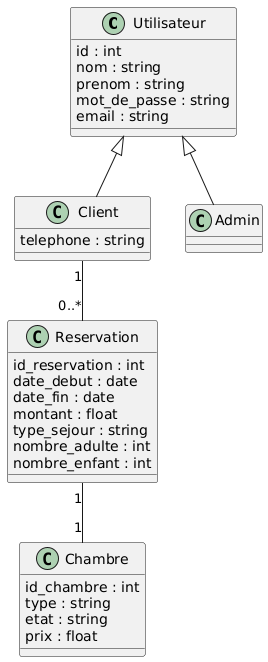

# GithubAGL
#  Application de Réservations d'Hôtel  

 Date de soumission : 07-04-2025  
 Auteurs : Ilef Marouani - Linda Hajjeji - Chayma kouki - Molka Mansouri 

---

## 1️⃣ Introduction au projet  
L'objectif de ce projet est de développer une application permettant la gestion des **réservations d'hôtel**.  
Cette application vise à **simplifier la gestion des chambres, des clients et des réservations** en offrant une plateforme **intuitive et efficace**.  

---

## 2️⃣ Spécification du projet  

###  a) Notions de base et contraintes  
✔️ **Authentification des utilisateurs** (administrateurs et clients).  
✔️ **Interface utilisateur intuitive** avec menu interactif.  
✔️ **Gestion des clients** (ajout, suppression, consultation).  
✔️ **Gestion des chambres** (ajout, suppression, consultation des disponibilités).  
✔️ **Gestion des réservations** (ajout, suppression, consultation de l'historique).  
✔️ **Sécurité des données** et gestion des rôles (droits d'accès différents pour administrateurs et clients).  

###  b) Acteurs et fonctionnalités attendues  

#### 🛠 **Administrateur**  
- ➕ Ajouter, supprimer et consulter la liste des **clients**.  
- 🏨 Ajouter, supprimer et consulter la liste des **chambres**.  
- 📅 Gérer les **réservations** (ajouter, supprimer, consulter toutes les réservations).  

#### 🏷 **Client**  
- 🛏 Réserver une **chambre**.  
- 📜 Consulter ses **réservations**.  
- ❌ Annuler une **réservation**.  

#### 🔐 **Système**  
- 🔑 **Authentifier les utilisateurs**.  
- 🔒 **Assurer l'intégrité et la sécurité des données**.  

## 3️⃣ Diagrammes UML

### a) Diagramme de cas d'utilisation
Voici le diagramme représentant les cas d'utilisation principaux de l'application.

### b) Raffinement du diagramme de cas d'utilisation
Le diagramme suivant reprèsente le raffinement des cas d'utilisation de l'admin .

### c) Diagramme de classes
Le diagramme suivant illustre la structure des classes principales du système.

### d) Diagramme de séquence système
Le diagramme suivant illustre les interactions principales entre les acteurs et le système lors des différents processus de gestion des réservations d’hôtel.

### e) Diagramme de séquence détaillé - Authentification
Le diagramme suivant représente en détail le processus d’authentification d’un utilisateur (client par défaut). Il montre les interactions entre l’utilisateur et le système, ainsi que la validation des informations d’identification avant d’accorder l’accès aux fonctionnalités correspondantes.

## 4️⃣ Priorités des cas d’utilisation

## Sprint 1 : Cas d’utilisation de haute priorité

Les fonctionnalités suivantes sont considérées comme essentielles et seront développées en priorité :

#### 🛑 1. Annuler une réservation

Ce cas d’utilisation permet à un client d’annuler une réservation existante sous certaines conditions (délai d’annulation autorisé, paiement effectué, etc.).

## 🔹 Diagramme de Séquence Détaillé – Annulation d’une Réservation
Le diagramme suivant illustre les interactions nécessaires pour que l'admin annule une réservation.

## 🔹 Diagramme d’Activité – Annulation d’une Réservation
Le diagramme ci-dessous représente le flux des actions pour traiter une annulation de réservation.

#### 🏨 2. Réservation d’une chambre

Ce cas d’utilisation permet à un utilisateur (Admin) de réserver une chambre en fonction des disponibilités et de ses préférences.

 ## 🔹 Diagramme de Séquence Détaillé – Réservation d’une Chambre
Ce diagramme montre les étapes d’interaction entre l'Admin et le système pour effectuer une réservation.

## 🔹 Diagramme d’Activité – Réservation d’une Chambre
Le diagramme d’activité suivant décrit le processus permettant à l'Admin de réserver une chambre.

# 5️⃣Spécifications et Tests de Validation  

## 📌 Cas d’utilisation : Annuler une réservation  

### ✅ Préconditions  
- **∧ ID de la réservation bien formé** (¬ null ∧ ¬ vide)  
- **∧ La réservation existe** dans le système  
- **∧ La réservation est toujours active** (non expirée)  
- **∧ L'administrateur est bien authentifié**  

### 📖 Scénario principal  
1. **L'administrateur accède au menu de gestion des réservations**  
   - Il interagit avec l'interface utilisateur.  
2. **Il sélectionne l'option "Annuler une réservation"**  
3. **Le système demande l’ID de la réservation**  
4. **L'administrateur saisit l’ID de la réservation**  
5. **Le système vérifie l'existence et la validité de la réservation**  
   - Vérifie si la réservation est active et non annulée.  
6. **Si la réservation est valide, le système :**  
   - Marque la chambre comme **disponible**.  
   - Supprime la réservation de la **base de données**.  
   - Met à jour le **nombre de réservations du client**.  
   - Affiche un message ✅ **"Réservation annulée avec succès !"**  
7. **Si la réservation n'existe pas ou est invalide, le système :**  
   - Affiche un message ❌ **"Aucune réservation correspondante trouvée !"**  

### 🎯 Postconditions  
- ✅ **∧ La réservation est supprimée** du système.  
- ✅ **∧ La chambre est marquée disponible**.  
- ✅ **∧ Le nombre total de réservations du client est mis à jour**.  

### 📊 Table de décision des tests  

| **Précondition**                                        | 1  | 2  | 3  | 4  | 5  | 6  | 7  |
|---------------------------------------------------------|----|----|----|----|----|----|----|
| **ID réservation bien formé (¬ null ∧ ¬ vide)**        | ❌  | ✅  | ✅  | ✅  | ✅  | ✅  | ✅  |
| **Réservation existe dans le système**                 | -  | ❌  | ✅  | ✅  | ✅  | ✅  | ✅  |
| **Réservation toujours active (non expirée)**          | -  | -  | ❌  | ✅  | ✅  | ✅  | ✅  |
| **Administrateur authentifié**                         | -  | -  | -  | ❌  | ✅  | ✅  | ✅  |
| **Postcondition**                                      |    |    |    |    |    |    |    |
| **Réservation supprimée du système**                   | ❌  | ❌  | ❌  | ❌  | ❌  | ✅  | ✅  |
| **Chambre marquée comme disponible**                   | -  | -  | -  | -  | -  | ❌  | ✅  |
| **Nombre total de réservations mis à jour**            | ❌  | ❌  | ❌  | ❌  | ❌  | ❌  | ✅  |
| **Nombre de jeux de tests**                            | 2  | 1  | 1  | 1  | 1  | 1  | 1  |

---

## 📌 Cas d’utilisation : Réservation d’une chambre  

### ✅ Préconditions  
- **∧ ID du client bien formé** (¬ null ∧ ¬ vide)  
- **∧ ID de la chambre bien formé** (¬ null ∧ ¬ vide)  
- **∧ Date de début et date de fin bien formées** (¬ null ∧ date_fin > date_debut)  
- **∧ Le client existe** dans le système  
- **∧ Le client n’a pas d’impayés ou restrictions**  
- **∧ La chambre existe et est disponible**  

### 📖 Scénario principal  
1. **L'administrateur accède au menu de gestion des réservations**  
2. **Il sélectionne "Ajouter une réservation"**  
3. **Le système demande les informations nécessaires :**  
   - ID du client, ID de la chambre  
   - Nombre d'adultes et d'enfants  
   - Type de séjour (Demi-pension / Pension complète)  
   - Date de début et de fin  
4. **L'administrateur saisit les informations**  
5. **Le système vérifie les données**  
   - **La date de fin > date de début**  
   - **Le client existe et n’a pas d'impayés**  
   - **La chambre est disponible**  
6. **Si tout est valide, le système :**  
   - ✅ Calcule le **montant total**  
   - ✅ Génère un **ID unique**  
   - ✅ Enregistre la **réservation**  
   - ✅ Marque la **chambre comme occupée**  
   - ✅ Affiche **"Réservation ajoutée avec succès !"**  
7. **Si une condition échoue :**  
   - ❌ **Message d'erreur correspondant**  

### 🎯 Postconditions  
- ✅ **∧ La réservation est enregistrée**  
- ✅ **∧ La chambre est marquée comme occupée**  
- ✅ **∧ Le nombre total de réservations du client est mis à jour**  

### 📊 Table de décision des tests  

| **Précondition**                                       | 1  | 2  | 3  | 4  | 5  | 6  | 7  | 8  |
|--------------------------------------------------------|----|----|----|----|----|----|----|----|
| **ID du client bien formé (¬ null ∧ ¬ vide)**         | ❌  | ✅  | ✅  | ✅  | ✅  | ✅  | ✅  | ✅  |
| **ID de la chambre bien formé (¬ null ∧ ¬ vide)**     | -  | ❌  | ✅  | ✅  | ✅  | ✅  | ✅  | ✅  |
| **Date de début et de fin bien formées**              | -  | -  | ❌  | ✅  | ✅  | ✅  | ✅  | ✅  |
| **Client existe dans le système**                     | -  | -  | -  | ❌  | ✅  | ✅  | ✅  | ✅  |
| **Chambre existe et disponible**                      | -  | -  | -  | -  | ❌  | ✅  | ✅  | ✅  |
| **Postcondition**                                     |    |    |    |    |    |    |    |    |
| **Réservation ajoutée**                               | ❌  | ❌  | ❌  | ❌  | ❌  | ❌  | ✅  | ✅  |
| **Chambre marquée comme occupée**                     | -  | -  | -  | -  | -  | -  | ❌  | ✅  |
| **Nombre total de réservations mis à jour**           | ❌  | ❌  | ❌  | ❌  | ❌  | ❌  | ❌  | ✅  |
| **Nombre de jeux de tests**                           | 2  | 2  | 2  | 1  | 1  | 1  | 1  | 1  |

## 6️⃣ Conception Préliminaire – Diagramme de Classes

### 🧠 Étape 1 : Identification des classes métier

À partir du document de spécifications et des cas d’utilisation , nous avons identifié les **classes métier** suivantes :

- **Utilisateur** : classe générale représentant une personne ayant un accès au système (héritée par Admin et Client).
- **Client** : utilisateur pouvant effectuer, consulter ou annuler des réservations.
- **Admin** : utilisateur responsable de la gestion des clients, chambres et réservations.
- **Chambre** : unité disponible à la réservation, caractérisée par son type, son état et son prix.
- **Reservation** : entité représentant l’action de réserver une chambre pour une période donnée.

---

### 🧱 Étape 2 : Diagramme de classes – version préliminaire

📎 Diagramme de classes :

